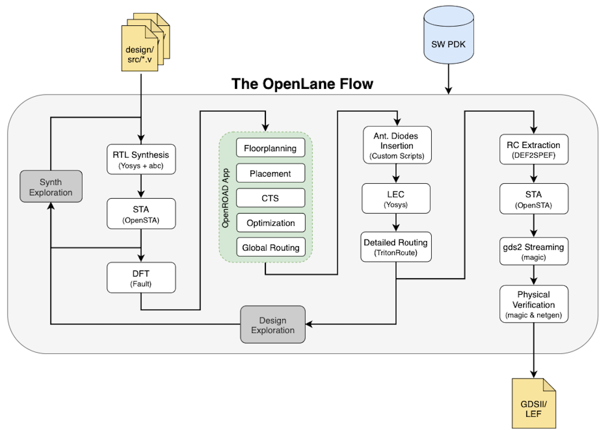
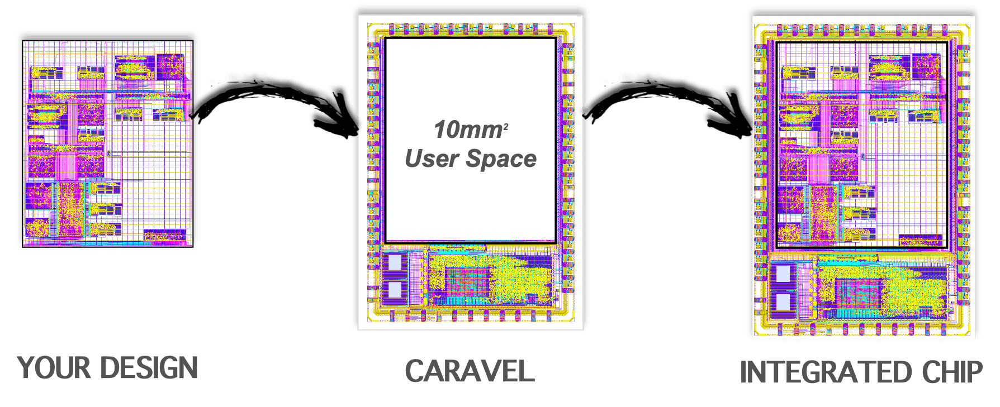
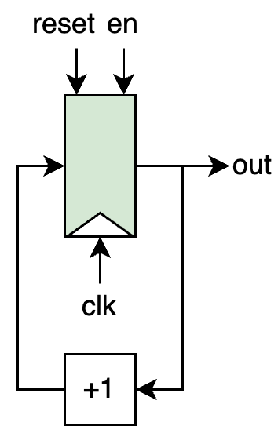

ECE 5745 Section 7: OpenLANE Open-Source Flow from C2S2
==========================================================================

 - Author: Aidan McNay, Christopher Batten
 - Date: March 17th, 2023

**Table of Contents**

 - Introduction
 - Counter Design
 - Test and Pickle the Design
 - Switching over to OpenLANE
 - OpenLANE Configurations
 - Pushing Through the Flow
 - DRC and LVS
 - Evaluating Area
 - Evaluating Cycle Time
 - Evaluating Power
 - Viewing our final GDS
 - Summary

Introduction
--------------------------------------------------------------------------

In the previous sections, we explored how we can use commercial tools to
build our designs. However, recent developments have allowed open-source
tools to perform similarly with much less startup cost. With open-source,
you no longer have to sign an NDA or work with protected tools to generate
designs that are viable for tape-outs, allowing *anyone* to tape out their
designs!

In this discussion, we will explore the 
[OpenLANE flow](https://openlane.readthedocs.io/en/latest/). OpenLANE is a 
combination of many open-source tools, predominantly 
[OpenROAD](https://github.com/The-OpenROAD-Project), with the open-source 
[Skywater 130nm PDK](https://github.com/google/skywater-pdk)

Note that you should not go into this tutorial expecting comparable results
to those obtained with Cadence and Synopsys. However, you should approach
it from the standpoint of someone without any access to industry tools.
If your local environment were to be set up correctly, this tutorial could
be run from there as well.

For an expedited process of bringing up your chip, we will also be using the
[Caravel harness](https://caravel-harness.readthedocs.io/en/latest/). Caravel
is a test harness that provides us with a pad ring and a 
[Litex VexRISCV SOC](https://caravel-mgmt-soc-litex.readthedocs.io/en/latest/).
This allows a user to use the given design space to make their desired design,
and not have to worry about a lot of the boilerplate hardware that goes into
interfacing the design with the outside world

The first step is to log into the C2S2 server - this should hopefully look very
similar to the steps you would follow for ECELinux (replacing `<netid>` with your
NetID):

    % ssh <netid>@c2s2-dev.ece.cornell.edu

You can use VS Code for 
working at the command line, but you will also need to a remote access option 
that supports Linux applications with a GUI such as X2Go, MobaXterm, or Mac 
Terminal with XQuartz. Once you are at the c2s2-dev prompt, source the C2S2 
setup script, clone this repository from GitHub, and define an environment 
variable to keep track of the top directory for the project. Note that if
you have your `.bashrc` set up to automatically source a setup script, you
will have to disable it for this tutorial.

    % source setup-c2s2.sh
    % mkdir -p $HOME/ece5745
    % cd $HOME/ece5745
    % git clone https://github.com/cornell-c2s2/ece5745_sec7.git sec7
    % cd sec7
    % TOPDIR=$PWD

Counter Design
--------------------------------------------------------------------------

For this tutorial, we will be using a very simple design; a free-running
counter with enable and reset lines. 

You can view the framework file here:

    % cd $TOPDIR/sim/counter
    % less CounterVRTL.v

Using your preferred code editor, modify the file to have the correct
functionality - it is very simple, and should only take a few lines of code.

Test and Pickle the Design
--------------------------------------------------------------------------

The first step is always to verify that our design works before we start
evaluating it. There is no sense in running the flow if the design is
incorrect! In addition, we will be dumping the
test benches in Verilog, so that we may use them again in OpenLANE

    % mkdir -p $TOPDIR/sim/build
    % cd $TOPDIR/sim/build
    % pytest ../counter/ --test-verilog --dump-vtb

You should now have the Verilog that we want to push through the ASIC
flow along with Verilog test benches that can be used for gate-level simulation.
Take a quick look at the final Verilog RTL and test benches.

    % cd $TOPDIR/sim/build
    % less Counter__pickled.v
    % less Counter_test_simple_tb.v
    % less Counter_test_simple_tb.v.cases

Switching over to OpenLANE
--------------------------------------------------------------------------

First, we should clone the Caravel User Project repository within our
section repository, as well as install a few wrapper designs, such as
Caravel and the Management Core Wrapper (Note: the `make` command may
take a few minutes)

    % cd $TOPDIR
    % git clone git@github.com:efabless/caravel_user_project.git openlane
    % cd openlane
    % git checkout bc4ccfec4b35d19220740f143ff1798fdfa4f0eb
    % make install check-env install_mcw setup-timing-scripts
    % OPENLANE_DIR=$PWD

Now that we have our pickled Verilog file, we can transfer it over to
OpenLANE to begin working with it within their environment! All of our
RTL code will live within the `caravel/verilog/rtl` folder

    % cp $TOPDIR/sim/build/Counter__pickled.v $OPENLANE_DIR/verilog/rtl/Counter.v
    % cd $OPENLANE_DIR/verilog/rtl

Unfortunately, the OpenLANE tools are currently configured to only accept
Verilog-2005, not SystemVerilog. For this, we can use an open-source tool
called [sv2v](https://github.com/zachjs/sv2v) to modify our code from SystemVerilog
to Verilog

    % mv Counter.v Counter.sv
    % sv2v -w adjacent Counter.sv
    % rm Counter.sv
    % less Counter.v

Notice the unusual declaration of the ports of the top-level `Counter` module - Yosys 
will not be able to understand this interface, so we must edit this to our more familiar 
declarations (often times, a lot of the challenges of open-source tools are getting them 
to work with others). In addition, another change we have to make to our Verilog file is to 
explicitly tell the OpenLANE scripts what type of power we want routed to the cells 
in our design. Using your preferred code editor, open your `Counter.v` file, and edit
the declaration of the top-level `Counter` module to look like this (deleting the later
delcarations of the ports as inputs and outputs):

    module Counter (
    `ifdef USE_POWER_PINS
        inout vccd1, // User area 1 1.8V supply
        inout vssd1, // User area 1 digital ground
    `endif
        input  logic        clk,
        input  logic        reset,
        input  logic        en,
        output logic [31:0] out
    );

OpenLANE Configurations
--------------------------------------------------------------------------

The other thing we need to do before pushing our design through the flow is 
to tell OpenLANE the configurations for our design - all the values of the
parameters it uses in the flow. For OpenLANE, each design has its own
configuration, stored in `$OPENLANE_DIR/openlane`:

    % cd $OPENLANE_DIR/openlane

We can start off by copying the configurations for the example project as a
baseline for our own, renaming some of the files as appropriate:

    % cp -r user_proj_example Counter
    % cd Counter
    % mv base_user_proj_example.sdc base_Counter.sdc

The main configuration file is `config.json` - open this file with your
preferred code editor. There are a few things we need to change in this
file to properly configure our design:

 - `DESIGN_NAME` should be "Counter"
 - In the `VERILOG_FILES`, replace the `user_proj_example` with `Counter` to
   use our Verilog file as a source
 - `CLOCK_PERIOD` should be 10 (in units of ns)
 - Both `CLOCK_PORT` and `CLOCK_NET` should be "clk" (the name of
   the clock port going into our submodule) to tell the flow which clock we're
   using
 - `DIE_AREA` should be "0 0 200 200" (indicating the corners of a rectangle 
   bounding our design, with units in um)
 - `BASE_SDC_FILE` should reference our renamed `base_Counter.sdc`
 - Delete the entries under `"pdk::sky130*"` and `"pdk::gf180mcuC"` entirely
   (they are if we want to specify different parameters for different libraries)

After doing this, your `config.json` should look like the version below:

    {
        "DESIGN_NAME": "Counter",
        "DESIGN_IS_CORE": 0,
        "VERILOG_FILES": [
            "dir::../../verilog/rtl/defines.v",
            "dir::../../verilog/rtl/Counter.v"
        ],
        "CLOCK_PERIOD": 10,
        "CLOCK_PORT": "clk",
        "CLOCK_NET": "clk",
        "FP_SIZING": "absolute",
        "DIE_AREA": "0 0 200 200",
        "FP_PIN_ORDER_CFG": "dir::pin_order.cfg",
        "NO_SYNTH_CELL_LIST": "dir::no_synth.cells",
        "DRC_EXCLUDE_CELL_LIST": "dir::drc_exclude.cells",
        "PL_TARGET_DENSITY": 0.4,
        "PL_RESIZER_SETUP_SLACK_MARGIN": 0.4,
        "PL_RESIZER_MAX_SLEW_MARGIN": 50,
        "GLB_RESIZER_MAX_SLEW_MARGIN": 50,
        "GLB_RESIZER_SETUP_SLACK_MARGIN": 0.2,
        "GRT_MAX_DIODE_INS_ITERS": 5,
        "GRT_ANT_ITERS": 5,
        "MAGIC_DEF_LABELS": 0,
        "SYNTH_BUFFERING": 0,
        "VDD_NETS": [
            "vccd1"
        ],
        "GND_NETS": [
            "vssd1"
        ],
        "IO_SYNC": 0,
        "BASE_SDC_FILE": "dir::base_Counter.sdc",
        "DIODE_INSERTION_STRATEGY": 3,
        "RUN_CVC": 1
    }

If you're curious about all the possible configurations, you can view them
[here](https://openlane.readthedocs.io/en/latest/reference/configuration.html)

We also need to modify the `pin_order.cfg` in the same directory, which gives
us some control about where OpenLANE routes the pins out of our block. To do
this, we indicate the side of the block with a comment (such as `#N` for North),
and then provide a RegEx that matches against all pins that you want on that side
(or multiple lines of RegEx). To stick with our block diagram layout, change this
file to the following:

    #N
    reset
    en

    #S
    clk

    #W
    out.*

Pushing Through the Flow
--------------------------------------------------------------------------

With this, our design has been properly configured from scratch! The flow
is automated via Makefiles:

    % cd $OPENLANE_DIR
    % make Counter

This may take a while (as most flows do), but will inform you which step
of the flow chart above it's currently on. Once the flow has completed,
you can view the reports and logs by going to the run directory for
your design:

    % cd $OPENLANE_DIR/openlane/Counter/runs/Counter
    % RESULTS_DIR=$PWD

DRC and LVS
--------------------------------------------------------------------------

The first thing we need to do is verify that our design passes DRC and LVS
checks:

    % less $RESULTS_DIR/reports/manufacturability.rpt

Here, we can see that our design passes DRC and LVS checks, as well as that
the antenna report is empty (indicating that we have no antenna errors).
For those that are curious, or may not have heard of them, antenna
violations arise when the tools detects that a particularly long wire may
experience sufficient charge buildup during plasma etching that it may
damage any gates it's connected to - more information can be found in
the textbook, specifically Section 3.6.1 and Figure 3.36.

Evaluating Area
--------------------------------------------------------------------------

Another important component of our designs is the area they take up

    % less $RESULTS_DIR/reports/signoff/25-rcx_sta.area.rpt 

Here, we can see that our design has a predictably small footprint - only
7% of the total area we gave it in our `config.json` (with the main
limitation being routing to our power grid - if pushed to a smaller
size, we couldn't connect to the power rails)

Evaluating Cycle Time
--------------------------------------------------------------------------

For this design, we specified in our `config.json` that our target clock
period is only 10ns - a very loose constraint, just so that we could
demonstrate the flow.

    % less $RESULTS_DIR/reports/signoff/25-rcx_sta.worst_slack.rpt

Here, we can see that we have quite a large amount of slack (I had 6.32ns),
indicating we might want to push our design faster in the future. We can
also view the breakdown of the critical path

    % less $RESULTS_DIR/reports/signoff/25-rcx_sta.rpt

We made it easy on our tools by only having one sequential path, but the
identification of the critical path is certainly useful with multiple
sequential paths.

Evaluating Power
--------------------------------------------------------------------------

Lastly, we can get a **rough** estimate of power consumtion. "Rough" is the
key here - we didn't tell our tools about the exact tasks we are running,
so this estimate is based off of a very general activity factor to tell
us the ball park of where we'd be operating.

    % less $RESULTS_DIR/reports/signoff/25-rcx_sta.power.rpt

Viewing our final GDS
--------------------------------------------------------------------------

We can lastly view our completed GDS using `klayout`! We'll also specify a
layer file, so that `klayout` can tell which layers are supposed to be what

    % klayout -l $TOPDIR/caravel.lyp $RESULTS_DIR/results/signoff/Counter.gds

Note that the `results` folder includes many other useful results, such
as a `.lef` file and a `.spice` file for our overall block, so it can
later be used as a macro for larger designs.

Summary
--------------------------------------------------------------------------

Working with the open-source flows can give you a sense of exactly what
you didn't know you'd miss from the commercial versions. The reports may
not be as precise, and the tools may take longer (lowering the clock period, 
for example, causes the resizer to take much longer). However, the fact that
we can generate these reports and results at all is a major achievement.
Because of these, any user can now generate a GDS, allowing them not only
to get concrete feedback about their designs, but crossing a major step
towards realizing the design in silicon.

For further exploration if you're curious, we've been following along in the
[Caravel User Project](https://github.com/efabless/caravel_user_project)
framework from Efabless. If you wish to go further, you can use this framework
to place your block inside the overall Caravel user space wrapper, as well as
conduct RTL and gate-level simulations with it, includinc C code that can run
on the RISCV core.
