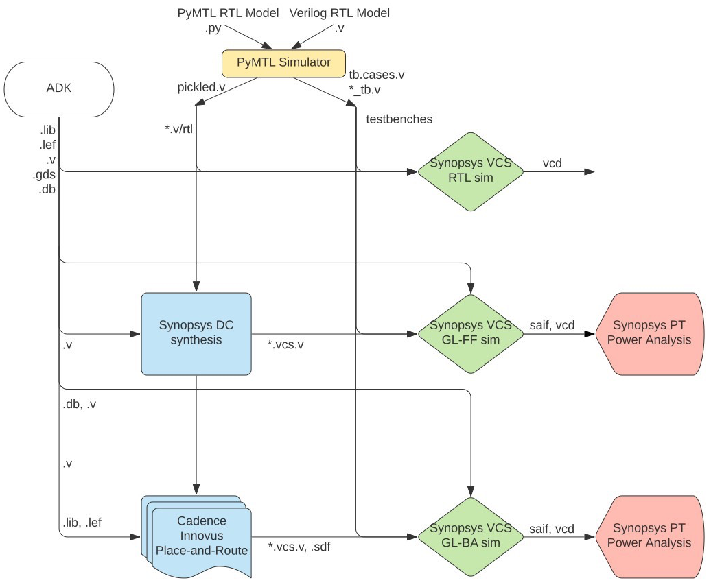

ECE 5745 Section 7: OpenLANE Open-Source Flow from C2S2
==========================================================================

 - Author: Aidan McNay
 - Date: February 10, 2023

**Table of Contents**

 - Introduction
 - Test, Simulate, and Translate the Design
 - Generating an ASIC Flow
 - Pushing the Design through the Automated ASIC Flow
 - Evaluating Cycle Time
 - Evaluating Area
 - Evaluating Energy
 - Summary

Introduction
--------------------------------------------------------------------------

In the previous sections, we explored how we can use commercial tools to
build our designs. However, recent developments have allowed open-source
tools to perform similarly with much less startup cost. With open-source,
you no longer have to sign an NDA or work with protected tools to generate
designs that are viable for tape-outs, allowing *anyone* to tape out their
designs!

In this discussion, we will explore the 
[OpenLANE flow](https://openlane.readthedocs.io/en/latest/). OpenLANE is a 
combination of many open-source tools, predominantly 
[OpenROAD](https://github.com/The-OpenROAD-Project), with the open-source 
[Skywater 130nm PDK](https://github.com/google/skywater-pdk)

Obviously, entering commands manually for each tool is very tedious and
error prone. An agile hardware design flow requires automation to
simplify rapidly exploring the cycle time, area, and energy design space
of one or more designs. Synopsys and Cadence tools can be scripted using
TCL, and even better, the ECE 5745 staff have already created these TCL
scripts along with a set of Makefiles to run the TCL scripts using a
framework called mflowgen. In this section, we will learn how to use this
automated flow to evaluate cycle time, area, and energy of both the
fixed-latency and variable-latency multipliers.

The first step is to start access `ecelinux`. You can use VS Code for
working at the command line, but you will also need to a remote access
option that supports Linux applications with a GUI such as X2Go,
MobaXterm, or Mac Terminal with XQuartz. Once you are at the ecelinux
prompt, source the setup script, clone this repository from GitHub, and
define an environment variable to keep track of the top directory for the
project.

    % source setup-ece5745.sh
    % mkdir -p $HOME/ece5745
    % cd $HOME/ece5745
    % git clone https://github.com/cornell-ece5745/ece5745-S03-asic-flow sec3
    % cd ece5745-S03-asic-flow
    % TOPDIR=$PWD

Test, Evaluate, and Pickle the Design
--------------------------------------------------------------------------

The first step is always to verify that our design works before we start
evaluating it. There is no sense in running the flow if the design is
incorrect!

    % mkdir -p $TOPDIR/sim/build
    % cd $TOPDIR/sim/build
    % pytest ../lab1_imul

The tests are for verification. We probably also want to do some
preliminary design-space exploration of execution time in cycles using an
evaluation simulator. You can run the evaluation simulator for our
fixed-latency and variable-latency multipliers like this:

    % cd $TOPDIR/sim/build
    % ../lab1_imul/imul-sim --impl fixed --input small --stats --translate --dump-vtb
    % ../lab1_imul/imul-sim --impl var   --input small --stats --translate --dump-vtb

You should now have the Verilog that we want to push through the ASIC
flow along with Verilog test benches that can be used for power analysis.
The test bench uses a stream of 50 inputs where each input is small
random number. Make a note of the execution time in cycles and the
average latency per multiply transaction for each design on your handout.
Take a quick look at the final Verilog RTL and test benches.

    % cd $TOPDIR/sim/build
    % less IntMulFixed__pickled.v
    % less IntMulVar__pickled.v
    % less IntMulFixed_imul-fixed-small_tb.v.cases
    % less IntMulVar_imul-var-small_tb.v.cases

Generating an ASIC Flow
--------------------------------------------------------------------------

In agile ASIC design, we usually prefer building _chip generators_
instead of _chip instances_ to enable rapidly exploring a design space of
possibilities. Similarly, we usually prefer using a _flow generator_
instead of a _flow instance_ so we can rapidly generate many different
flows for different designs, parameters, and even ADKs. We will use
the mflowgen framework as our flow generator. You can read more about
mflowgen here:

  - <https://mflowgen.readthedocs.io/en/latest>

We use a `flow.py` file to configure the flow. Every design you want to
push through the flow should have its own unique subdirectory in the
`asic` directory with its own `flow.py`. Let's take a look at the
`flow.py` for the fixed-latency multiplier here:

    % cd $TOPDIR/asic
    % less lab1-fixed/flow.py

There is quite a bit of information in the `flow.py`, but the important
configuration information is placed at the top:

    #-----------------------------------------------------------------------
    # Parameters
    #-----------------------------------------------------------------------

    at_name = 'freepdk-45nm'
    adk_view = 'stdview'

    parameters = {
      'construct_path'  : __file__,
      'sim_path'        : "{}/../../sim".format(this_dir),
      'design_path'     : "{}/../../sim/lab1_imul".format(this_dir),
      'design_name'     : 'IntMulFixed',
      'clock_period'    : 0.6,
      'clk_port'        : 'clk',
      'reset_port'      : 'reset',
      'adk'             : adk_name,
      'adk_view'        : adk_view,
      'pad_ring'        : False,

      # VCS-sim
      'test_design_name': 'IntMulFixed',
      'input_delay'     : 0.05,
      'output_delay'    : 0.05,

      # Synthesis
      'gate_clock'      : True,
      'topographical'   : False,

      # PT Power
      'saif_instance'   : 'IntMulFixed_tb/DUT',
    }

The `adk_name` specifies the targeted technology node and fabrication
process. The `design_path` points to where all of the source files are
and the `design_name` is the name of the corresponding top-level module.
The `clock_period` is the target clock period we want to use for
synthesis and place-and-route. Further down in the `flow.py` you can find
all of the steps along with how those steps are connected together to
create the complete flow.

To get started create a build directory and run mflowgen. Every push
through the ASIC flow should be in its own unique build directory. You
need to explicitly specify which design you want to push through the flow
when you run mflowgen.

    % mkdir -p $TOPDIR/asic/build-lab1-fixed
    % cd $TOPDIR/asic/build-lab1-fixed
    % mflowgen run --design ../lab1-fixed
    % make list
    % make status

The `list` Makefile target will display the various steps in the flow.
You can use the `status` Makefile target to see which steps have been
completed. The Makefile will take care of running the steps in the right
order. You can use the `graph` Makefile target to generate a figure of
the overall ASIC flow.

    % cd $TOPDIR/asic/build-lab1-fixed
    % make graph

You can open the generated `graph.pdf` file to see the figure which is a
much more detailed version of the high-level flow graph shown above.

Pushing the Design through the Automated ASIC Flow
--------------------------------------------------------------------------

We want to use the generated flow to complete all of the steps from the
previous discussion sections:

 - run all of the tests to generate appropriate Verilog test harnesses
 - run all of the tests using 4-stage RTL simulation
 - perform synthesis (the front-end of the flow)
 - run all of the test using fast-functional gate-level simulation
 - perform place-and-route (the back-end of the flow)

Here are the corresponding commands. Each Makefile target corresponds to
one of the above steps.

    % cd $TOPDIR/asic/build-lab1-fixed
    % make ece5745-block-gather
    % make brg-rtl-4-state-vcssim
    % make brg-synopsys-dc-synthesis
    % make post-synth-gate-level-simulation
    % make brg-cadence-innovus-signoff

Instead of typing the complete step name, you can also just use the step
number shown when you use the `list` Makefile target. Go ahead and work
through each step one at a time and monitor the output. You can also use
the `status` and `runtimes` Makefile targets to see the status of each
step and how long each step has taken.

    % cd $TOPDIR/asic/build-lab1-fixed
    % make status
    % make runtimes

Make sure the design passes four-state RTL simulation, fast-functional
gate-level simulation, and back-annotated gate-level simulation! Keep in
mind it can take 5-10 minutes to push simple designs completely through
the flow and up to an hour to push more complicated designs through the
flow. Consider using just the ASIC flow front-end to ensure your design
is synthesizable and to gain some rough early intuition on area and
timing. Then you can iterate quickly and eventually focus on the ASIC
flow back-end.

We can now open up Cadence Innovus to take a look at our final design.

    % cd $TOPDIR/asic/build-lab1-fixed/11-brg-cadence-innovus-signoff
    % innovus -64 -nolog
    innovus> source checkpoints/design.checkpoint/save.enc

You can use the design browser to help visualize how modules are mapped
across the chip. Here are the steps:

 - Choose _Windows > Workspaces > Design Browser + Physical_ from the menu
 - Hide all of the metal layers by pressing the number keys
 - Browse the design hierarchy using the panel on the left
 - Right click on a module, click _Highlight_, select a color

You can use the following steps in Cadence Innovus to display where the
critical path is on the actual chip.

 - Choose _Timing > Debug Timing_ from the menu
 - Right click on first path in the _Path List_
 - Choose _Highlight > Only This Path > Color_

You can create a screen capture to create an amoeba plot of your chip
using the _Tools > Screen Capture > Write to GIF File_. We recommend
inverting the colors so your amoeba plot looks better in a report.

_To Do On Your Own:_ Highlight the critical path and some of the key
modules in the fixed-latency multiplier. Create an amoeba plot, copy it
to the workstation, and open it using the default Windows viewer.

Evaluating Cycle Time
--------------------------------------------------------------------------

Now let's explore the critical path in more detail. You can find a
summary in the reports generated by Cadence Innovus.

    % cd $TOPDIR/asic/build-lab1-fixed
    % less 11-brg-cadence-innovus-signoff/reports/timing.rpt

The report shows the critical path through the design. You should see
positive slack meaning the design is able to meeting timing.

    Path 1: MET Setup Check with Pin v/dpath/result_reg/q_reg_25_/CK
    Endpoint:   v/dpath/result_reg/q_reg_25_/D (^) checked with  leading edge of
    'ideal_clock'
    Beginpoint: v/dpath/a_reg/q_reg_3_/Q       (v) triggered by  leading edge of
    'ideal_clock'
    Path Groups: {Reg2Reg}
    Analysis View: analysis_default
    Other End Arrival Time         -0.014
    - Setup                         0.029
    + Phase Shift                   0.600
    + CPPR Adjustment               0.000
    = Required Time                 0.557
    - Arrival Time                  0.554
    = Slack Time                    0.003
         Clock Rise Edge                 0.000
         + Clock Network Latency (Prop)  0.003
         = Beginpoint Arrival Time       0.003
         +-------------------------------------------------------------------------------------+
         |           Instance           |     Arc      |   Cell   | Delay | Arrival | Required |
         |                              |              |          |       |  Time   |   Time   |
         |------------------------------+--------------+----------+-------+---------+----------|
         | v/dpath/a_reg/q_reg_3_       | CK ^         |          |       |   0.003 |    0.006 |
         | v/dpath/a_reg/q_reg_3_       | CK ^ -> Q v  | DFF_X1   | 0.097 |   0.099 |    0.102 |
         | v/dpath/add/add_x_1/U323     | A2 v -> ZN ^ | NOR2_X1  | 0.047 |   0.147 |    0.150 |
         | v/dpath/add/add_x_1/U351     | B1 ^ -> ZN v | OAI21_X1 | 0.021 |   0.168 |    0.171 |
         | v/dpath/add/add_x_1/U352     | A v -> ZN ^  | AOI21_X1 | 0.058 |   0.226 |    0.229 |
         | v/dpath/add/add_x_1/U367     | B1 ^ -> ZN v | OAI21_X1 | 0.035 |   0.261 |    0.264 |
         | v/dpath/add/add_x_1/U391     | B1 v -> ZN ^ | AOI21_X1 | 0.115 |   0.376 |    0.379 |
         | v/dpath/add/add_x_1/U472     | B1 ^ -> ZN v | OAI21_X1 | 0.034 |   0.410 |    0.413 |
         | v/dpath/add/add_x_1/U477     | B1 v -> ZN ^ | AOI21_X1 | 0.040 |   0.450 |    0.453 |
         | v/dpath/add/add_x_1/U310     | A ^ -> ZN ^  | XNOR2_X1 | 0.043 |   0.493 |    0.496 |
         | v/dpath/add_mux/U9           | A1 ^ -> ZN v | NAND2_X1 | 0.016 |   0.509 |    0.512 |
         | v/dpath/add_mux/U11          | A1 v -> ZN ^ | NAND2_X1 | 0.015 |   0.524 |    0.527 |
         | v/dpath/result_mux/U18       | A1 ^ -> ZN ^ | AND2_X1  | 0.030 |   0.554 |    0.557 |
         | v/dpath/result_reg/q_reg_25_ | D ^          | DFF_X1   | 0.000 |   0.554 |    0.557 |
         +-------------------------------------------------------------------------------------+

_To Do On Your Own:_ Since your design meets timing, enter the clock
constraint as the cycle time on your handout. Highlight the critical path
on the datapath diagram for the fixed-latency multiplier. Annotate each
component along the critical path with a rough estimate of its delay in
picoseconds. Don’t forget to estimate the register clock-to-q delay and
the register setup time. What components are consuming the most time
along the critical path?

Let's now try pushing the variable latency multiplier through the flow
with the same clock constraint.

    % mkdir $TOPDIR/asic/build-lab1-var
    % cd $TOPDIR/asic/build-lab1-var
    % mflowgen run --design ../lab1-var
    % make ece5745-block-gather
    % make brg-rtl-4-state-vcssim
    % make brg-synopsys-dc-synthesis
    % make post-synth-gate-level-simulation
    % make brg-cadence-innovus-signoff

_To Do On Your Own:_ Enter the clock constraint as the cycle time on your
handout. Highlight the critical path on the datapath diagram for the
variable-latency multiplier. Annotate each component along the critical
path with a rough estimate of its delay in picoseconds. Don’t forget to
estimate the register clock-to-q delay and the register setup time. What
components are consuming the most time along the critical path?

Evaluating Area
--------------------------------------------------------------------------

In addition to evaluating cycle time, we also want to evaluate area.
While the synthesis reports include rough area estimates, the reports
from place-and-route will be much more accurate

    % cd $TOPDIR/asic/build-lab1-fixed
    % less 11-brg-cadence-innovus-signoff/reports/area.rpt

The report is hierarchical showing you how much area is used by each
component in the design. Do the same for the variable latency multiplier.

    Hinst Name                   Module Name                                  Inst Count  Total Area
    ------------------------------------------------------------------------------------------------
    IntMulFixed                                                                      619    1032.878
     v                           IntMulFixed_lab1_imul_IntMulFixed_0                 619    1032.878
      v/ctrl                     IntMulFixed_lab1_imul_IntMulFixedCtrl_0              63      90.440
       v/ctrl/counter            IntMulFixed_vc_BasicCounter...                       49      69.692
        v/ctrl/counter/count_reg IntMulFixed_vc_ResetReg_p_nbits6_p_reset_value0_0    18      35.112
      v/dpath                    IntMulFixed_lab1_imul_IntMulFixedDpath_0            522     905.730
       v/dpath/a_mux             IntMulFixed_vc_Mux2_p_nbits32_3                      32      58.786
       v/dpath/a_reg             IntMulFixed_vc_Reg_p_nbits32_1                       32     144.704
       v/dpath/add               IntMulFixed_vc_SimpleAdder_p_nbits32_0              270     244.188
        v/dpath/add/add_x_1      IntMulFixed_vc_SimpleAdder_p_nbits32_DW01_add_0_0   270     244.188
       v/dpath/add_mux           IntMulFixed_vc_Mux2_p_nbits32_2                      55      67.298
       v/dpath/b_mux             IntMulFixed_vc_Mux2_p_nbits32_0                      32      58.786
       v/dpath/b_reg             IntMulFixed_vc_Reg_p_nbits32_0                       32     144.704
       v/dpath/lshifter          IntMulFixed_vc_LeftLogicalShifter...                  0       0.000
       v/dpath/result_mux        IntMulFixed_vc_Mux2_p_nbits32_1                      34      35.378
       v/dpath/result_reg        IntMulFixed_vc_EnReg_p_nbits32_0                     34     150.556
       v/dpath/rshifter          IntMulFixed_vc_RightLogicalShifter...                 0       0.000

_To Do On Your Own:_ Annotate each component in the datapath diagram for
both the fixed-latency and variable-latency multipliers with a rough
estimate of its area in square um. What components are consuming the most
area? Compare the area between the fixed and variable latency
multipliers. Where is the area overhead coming from?

Evaluating Energy
--------------------------------------------------------------------------

Finally, we want to evaluate the energy of our designs. To do this we
combine activity factors from the post-synthesis gate-level simulation
with information about each standard cell. Recall that we ran the
evaluation simulator with two different input patterns: 100 zeros and 100
random values. We can use the power analysis steps to calculate the total
energy consumed for each pattern.

    % cd $TOPDIR/asic/build-lab1-fixed
    % make post-synth-power-analysis

We can see the total number of cycles and the energy for each pattern.

    imul-fixed-small.vcd
      exec_time = 1759 cycles
      power     = 1.57 mW
      energy    = 1.65698 nJ

We can also look at a hierarchical breakdown of where the power (energy)
is consumed in the design:

    % cd $TOPDIR/asic/build-lab1-fixed
    % less 9-post-synth-power-analysis/reports/imul-fixed-small/power/IntMulFixed.power.hier.rpt

We can see that much of the power is consumed in the registers.

_To Do On Your Own:_ Enter the energy for both the fixed-latency and
variable-latency multipliers on your handout.

Summary
--------------------------------------------------------------------------

There is a final summary step which will report the outcome of all of the
tests along with the cycle time, area, and power numbers.

    % cd $TOPDIR/asic/build-lab1-fixed
    % make brg-flow-summary

    design_name = IntMulFixed

    area & timing
      design_area   = 1032.878 um^2
      stdcells_area = 1032.878 um^2
      macros_area   = 0.0 um^2
      chip_area     = 13131.888 um^2
      core_area     = 1571.528 um^2
      constraint    = 0.6 ns
      slack         = 0.003 ns
      actual_clk    = 0.597 ns

    imul-fixed-small.vcd
      exec_time = 1759 cycles
      power     = 1.57 mW
      energy    = 1.65698 nJ

You can also run all steps just by using `make` without any target, but
you should only do this after you have carefully verified that the design
meets timing and passes all tests. Here is how to do a clean build from
scratch:

    % rm -rf $TOPDIR/sim/build
    % rm -rf $TOPDIR/asic/build-lab1-fixed

    % mkdir -p $TOPDIR/sim/build
    % cd $TOPDIR/sim/build
    % pytest ../lab1_imul
    % ../lab1_imul/imul-sim --impl fixed --input small --stats --translate --dump-vtb
    % ../lab1_imul/imul-sim --impl var   --input small --stats --translate --dump-vtb

    % mkdir -p $TOPDIR/asic/build-lab1-fixed
    % cd $TOPDIR/asic/build-lab1-fixed
    % mflowgen run --design ../lab1-fixed
    % make

    % mkdir -p $TOPDIR/asic/build-lab1-var
    % cd $TOPDIR/asic/build-lab1-var
    % mflowgen run --design ../lab1-var
    % make

And don't forget you can always check out the final layout too!

    % cd $TOPDIR/asic/build-lab1-fixed
    % klayout -l $ECE5745_STDCELLS/klayout.lyp 11-brg-cadence-innovus-signoff/outputs/design.gds

    % cd $TOPDIR/asic/build-lab1-var
    % klayout -l $ECE5745_STDCELLS/klayout.lyp 11-brg-cadence-innovus-signoff/outputs/design.gds

